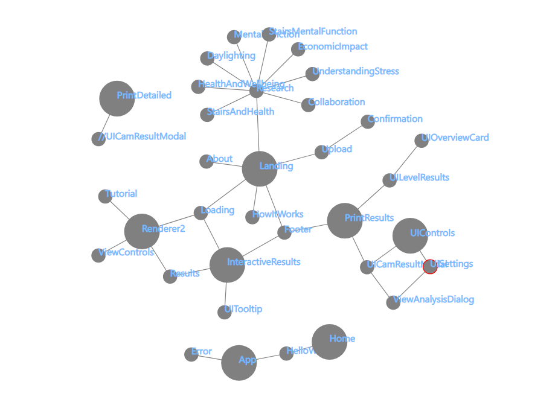
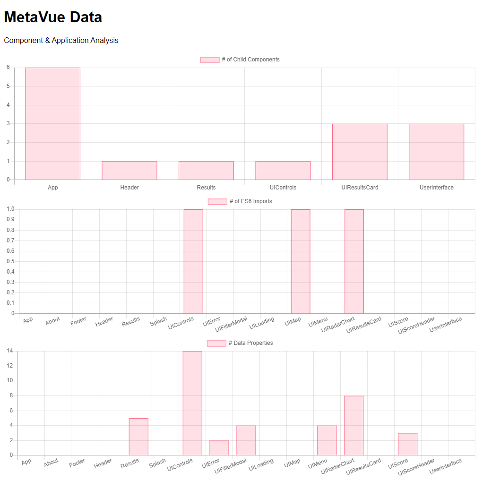

# MetaVue

[](https://mitevpi.github.io/metavue/)
[](docs)

[](https://www.npmjs.com/package/metavue)
[](https://bundlephobia.com/result?p=@metavue)
[](https://www.npmjs.com/package/metavue)
[](https://www.npmjs.com/package/metavue)

[](https://github.com/mitevpi/metavue/issues) 
[](https://github.com/mitevpi/metavue/commits/master)


Utility for extracting metadata between of Vue.js components in
application architecture.

## Usage

### Install

Install globally by running the command below on a cmd/terminal:

```cmd
npm i -g metavue
```

### Use

Once installed, the CLI utility can be used from any cmd/terminal instance
using the following command:

```cmd
metavue -d PATH_TO_YOUR_VUE_APP
```

### Output

The CLI utility will generate a folder called `.metavue` in the root
directory of the Vue application with `.json` files containing the
metadata of your Vue application, and a static site at `index.html`
which can be used to visualize the data.

#### Sample

```json
// ComponentArchitecture.json
 {
    "path": "/Users/mitevpi/Documents/GitHub/stroll-app/src/App.vue",
    "name": "App",
    "imports": null,
    "data": [
        "selectMobile",
        "isMobile",
        "roundAmount",
        "currentPage"
    ],
    "components": [
        "Footer",
        "Header",
        "LogIn",
        "UserInterface",
        "Splash"
    ]
},
```

```json
// ParentChildData.json
{
    "parent": "App",
    "child": "Footer"
},
{
    "parent": "App",
    "child": "Header"
},
{
    "parent": "App",
    "child": "LogIn"
},
```

Custom Visualization From Data (PowerBI)



Static Site Output (This CLI)


