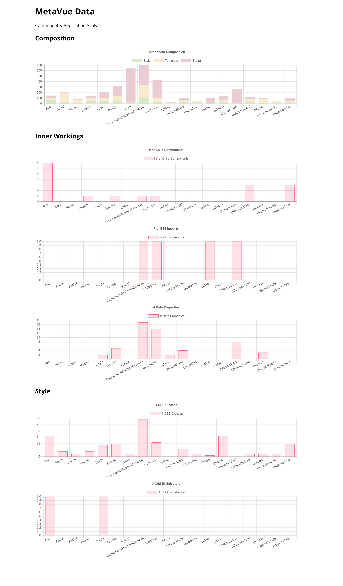

# MetaVue

[](https://mitevpi.github.io/metavue/)
[](docs)
[](https://metavue-demo.now.sh/)

[](https://www.npmjs.com/package/metavue)
[](https://bundlephobia.com/result?p=metavue)
[](https://www.npmjs.com/package/metavue)
[](https://www.npmjs.com/package/metavue)

[](https://github.com/mitevpi/metavue/issues) 
[](https://github.com/mitevpi/metavue/commits/master)

Utility for extracting metadata between of Vue.js components in
application architecture. ([Demo](https://metavue-demo.now.sh/))

## Usage

### Install

Install globally by running the command below on a cmd/terminal:

```cmd
npm i -g metavue
```

### Use

Once installed, the CLI utility can be used from any cmd/terminal instance
using the following command:

```cmd
metavue -d PATH_TO_YOUR_VUE_APP
```

### Output

The CLI utility will generate a folder called `.metavue` in the root
directory of the Vue application with `.json` files containing the
metadata of your Vue application, and a static site at `index.html`
which can be used to visualize the data.

Deply or run the `index.html` file in the `.metavue` folder using a http
server to visualize the data export, or import the `json` files yourself
in a data visualization platform to explore your application's metadata.

#### Sample

##### Custom Visualization From Data (PowerBI)


##### Static Site Output (This CLI)



##### Data Output

`ComponentArchitecture.json`

```json
 {
    "path": "/Users/mitevpi/Documents/GitHub/stroll-app/src/App.vue",
    "name": "App",
    "lines": 149,
    "imports": null,
    "data": [],
    "dataCount": 0,
    "components": [
        "Footer",
        "Header",
        "LogIn",
        "Results",
        "About",
        "UserInterface",
        "Splash"
    ],
    "cssClasses": [
        ".main",
        ".v-card",
        ".fade-enter",
        ".fade-leave-to",
        ".fade-leave-active",
        ".delayed-fade-enter-active",
        ".delayed-fade-enter",
        ".delayed-fade-leave-active",
        ".delayed-fade-leave-to",
        ".fade-leave-active"
    ],
    "cssIdSelectors": [
        "#footer"
    ],
    "templateLength": 35,
    "scriptLength": 47,
    "styleLength": 64,
    "commentLength": 4,
    "cssClassesCount": 16,
    "cssIdSelectorsCount": 1
},
```

`ParentChildData.json`

```json
{
    "parent": "App",
    "child": "Footer"
},
{
    "parent": "App",
    "child": "Header"
},
{
    "parent": "App",
    "child": "LogIn"
},
```
